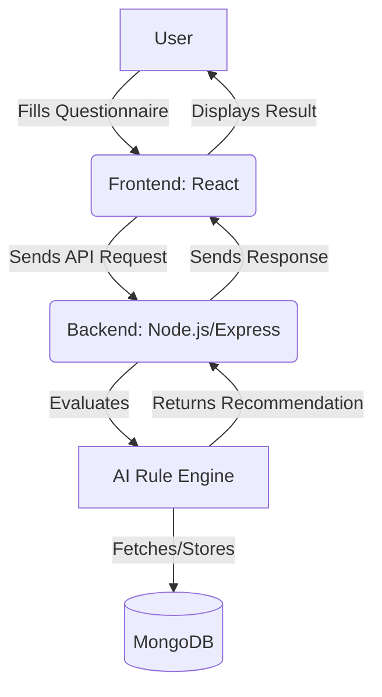

# AI-Driven Software Architecture Decision System

## Overview
This project is a dissertation for Kingston University by Yash Rana (K2256939). It is an AI-powered web-based decision support system that helps developers and teams select the most suitable software architecture and design patterns for their projects.

## Features
- Modular Node.js/Express backend with AI rule engine
- RESTful API for questionnaire, recommendations, and learning resources
- (Planned) React frontend for user interaction
- Educational content and real-world case studies

## System Architecture


## Project Structure
```
SoftwareselctionAI/
├── Back-End/   # Node.js/Express API
├── Front-End/  # (Planned) React App
├── README.md   # Project overview
└── DEVELOPMENT_LOG.md # Progress log
```

## Setup Instructions
See [Back-End/README.md](./Back-End/README.md) for backend setup and API documentation.

## Development Log
See [DEVELOPMENT_LOG.md](./DEVELOPMENT_LOG.md) for daily progress and notes.

---

## Author
Yash Rana (K2256939) - Kingston University

---

> This project is under active development for MSc dissertation. For questions, contact the author. 